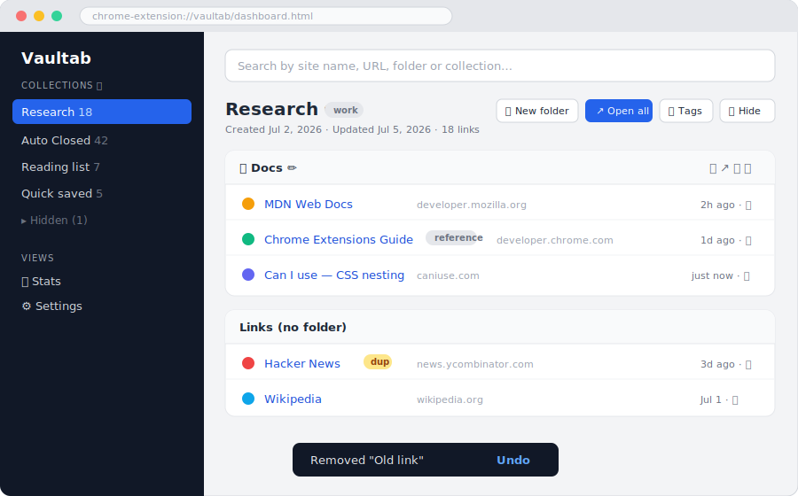
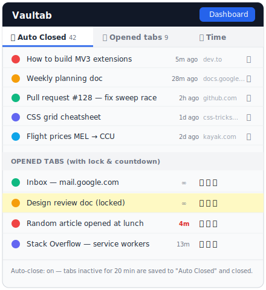
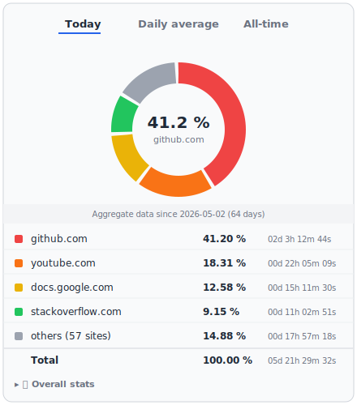

<div align="center">


### Tab Manager, Auto-Close & Time Tracker for Chrome

[](https://github.com/maverick-360/vaultab)
[](https://developer.chrome.com/docs/extensions/mv3/)
[](LICENSE)
[](manifest.json)

**Save tabs into organised collections · Auto-close idle tabs · Track time per website**  
_Everything stays on your device — no accounts, no servers._


</div>

---

## ✨ Features

### 📁 Collections & Folders
Organise saved links into named **collections** and **sub-folders**. Drag-and-drop to reorder or move links between folders. Rename anything inline. Collections and folders can be **hidden** and restored with one click. Everything survives export/import.

### ⏲️ Auto-Close
Tabs idle for a configurable time (default: 20 min) are automatically closed and filed into an **Auto Closed** collection — grouped by domain, with duplicates replaced instead of stacked. Active, pinned, audible, and locked tabs are never touched. Set scope to all sites, a **whitelist**, or a **blacklist**.

### 🔒 Tab & Site Locking
Lock individual tabs for the session (🔒) or **permanently lock a site** (📌) so it's always exempt from auto-close. Locked sites match subdomains and persist across restarts. Manage them in **Settings → Locked sites**.

### ⏱️ Time Tracking & Analytics
The popup's **Time panel** shows a donut chart of time spent per site (Today / Daily avg / All-time). Click any slice to drill into: first & last visit, visited-day count, rank, per-day timeline, and a **weekday histogram**. Tracks the focused tab on http(s) pages, pauses when Chrome is idle.

### 🔍 Search & Duplicate Detection
Instant search across collection names, folder names, page titles, URLs, and **tags** with highlighted results. Duplicate URLs get a "dup" badge and a one-click **Remove duplicates** button. The popup offers **Close duplicate tabs** for the current window.

### 🏷️ Tags
Tag any link, folder, or collection via the 🏷 button. Tags render as clickable chips, clicking one searches it. Tags survive export/import.

### 📊 Stats
A grouped SVG bar chart (no libraries) shows 14 days of opened / closed / auto-closed counts. A **Most auto-closed sites** top-10 table is backed by uncapped per-hostname counters.

### ⌨️ Keyboard Shortcuts
| Shortcut | Action |
|----------|--------|
| `Cmd/Ctrl+Shift+S` | Save current tab to "Quick saved" |
| `Cmd/Ctrl+Shift+L` | Toggle lock on current tab |
| `Cmd/Ctrl+Shift+K` | Open the dashboard |

Rebind at `chrome://extensions/shortcuts`.

### Other Highlights
- **Import / Export** — full JSON backup; stats merged additively; CSV time-data export
- **Undo** — delete anything and undo within 6 seconds, no confirm dialogs
- **Themes** — Light, Dark, Ocean, and Catppuccin (applies to popup + dashboard)
- **Restore options** — open a collection in current or new window; optionally remove links on open
- **Synced settings** — preferences follow your Chrome profile across machines
- **Single-tab save** — ➕ button in popup saves one tab to any collection

---

## 📸 Screenshots

> Illustrative mockups — load the extension to see the real thing.

<p align="center">
  
  &nbsp;
  
</p>

<p align="center">
  
</p>


---

## 🚀 Install (Developer Mode)

> Chrome Web Store listing coming soon. In the meantime, load it unpacked:

1. Clone or download this repo
   ```bash
   git clone https://github.com/maverick-360/vaultab.git
   ```
2. Open `chrome://extensions`
3. Enable **Developer mode** (toggle, top-right)
4. Click **Load unpacked** → select the `vaultab/` folder

The Vaultab icon appears in your toolbar immediately.

---

## 🖱️ Usage

- **Toolbar popup** — two panels:
  - **Auto Closed** — browse and reopen recently auto-closed tabs
  - **Opened Tabs** — all current tabs with lock/pin/save controls and auto-close countdowns
- **Dashboard** (`Cmd/Ctrl+Shift+K` or the Dashboard button) — full manager: collections, folders, search, tags, stats, settings, import/export

---

## 🏗️ Project Structure

| File | Purpose |
|------|---------|
| `manifest.json` | MV3 manifest — permissions: `tabs`, `storage`, `alarms`, `favicon`, `idle` |
| `background.js` | Service worker — auto-close sweep (1-min alarm), tab activity & time tracking, stats |
| `popup.html/js/css` | Toolbar popup — opened tabs panel, auto-closed panel, time panel |
| `dashboard.html/js/css` | Full-page manager — collections, folders, tags, search, stats, settings |
| `common.js` | Shared storage helpers and formatters |
| `icons/` | Extension icons (16, 32, 48, 128 px) |

---

## 🗄️ Data Model

**`chrome.storage.local`** (on-device only):
```
collections:       [{ id, name, createdAt, updatedAt, tags?,
                      folders: [{ id, name, createdAt, updatedAt, tags?, tabs: [...] }],
                      tabs: [{ id, title, url, addedAt, lastOpenedAt?, tags? }] }]
lockedSites:       ["mail.google.com", ...]
autoCloseList:     ["news.ycombinator.com", ...]
stats:             { opened, closed, autoClosed, byDay, autoClosedSites }
timeSpent:         { "YYYY-MM-DD": { hostname: seconds } }
timeTrackingSince: timestamp
```

**`chrome.storage.sync`** (follows your Chrome profile):
```
settings: { autoCloseEnabled, autoCloseMinutes, minTabsPerWindow,
            autoClosedCap, theme, restoreRemoves, autoCloseScope }
```

---

## 📦 Import Format

Import accepts a full export (`{ "collections": [...] }`) or a bare array. Only `url` is required per tab. Stats objects are merged additively.

```json
{
  "collections": [
    {
      "name": "Research",
      "folders": [
        { "name": "Docs", "tabs": [{ "title": "MDN", "url": "https://developer.mozilla.org/" }] }
      ],
      "tabs": [{ "title": "Wikipedia", "url": "https://www.wikipedia.org/" }]
    }
  ]
}
```

---

## 🔐 Privacy

Vaultab stores everything locally using Chrome's built-in storage APIs. **No data is ever sent to any external server.** No analytics, no telemetry, no accounts required.

- `chrome.storage.local` — collections, time data, stats *(stays on your device)*
- `chrome.storage.sync` — settings only *(synced via Google's infrastructure across your own Chrome profile)*

See [CHROMEWEBSTORE.md](CHROMEWEBSTORE.md) for the full privacy policy draft and permissions justification.

---

## 🤝 Contributing

Contributions, bug reports, and feature requests are welcome!

1. [Open an issue](https://github.com/maverick-360/vaultab/issues) first for significant changes
2. Fork the repo and create a feature branch
3. Load the extension unpacked and test your change
4. Submit a pull request — use the PR template

Please read the [pull request template](.github/PULL_REQUEST_TEMPLATE.md) before submitting.

---

## 📄 License

[MIT](LICENSE) © 2026 Soumavo Dey
